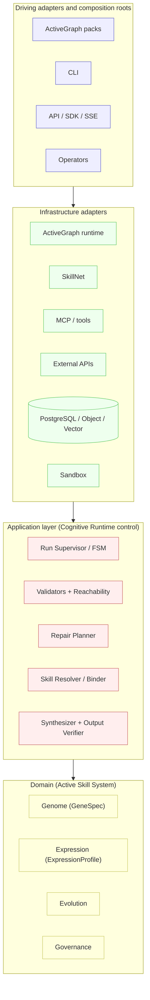
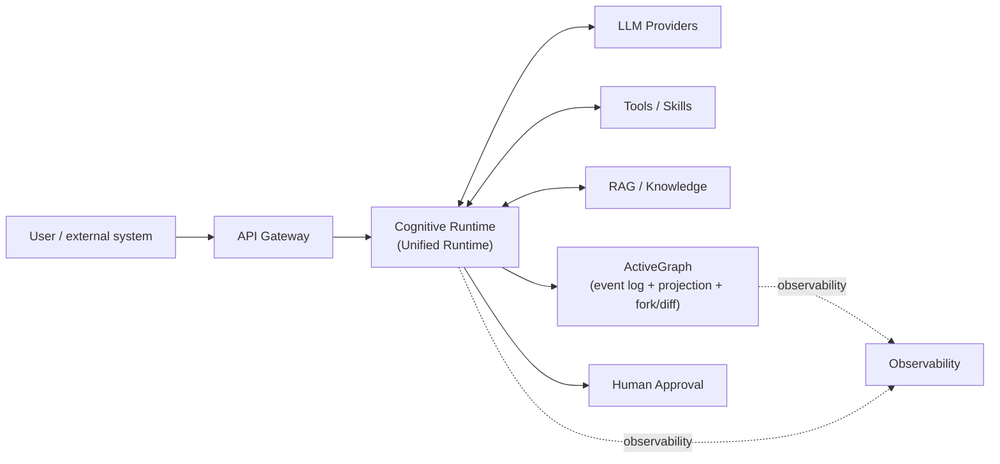
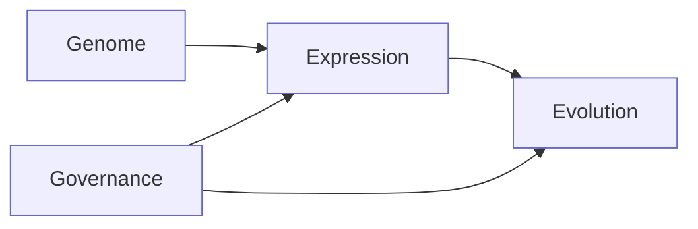
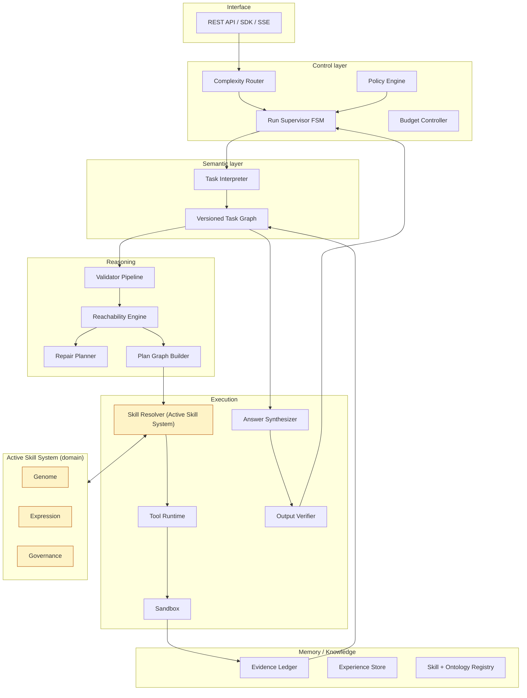
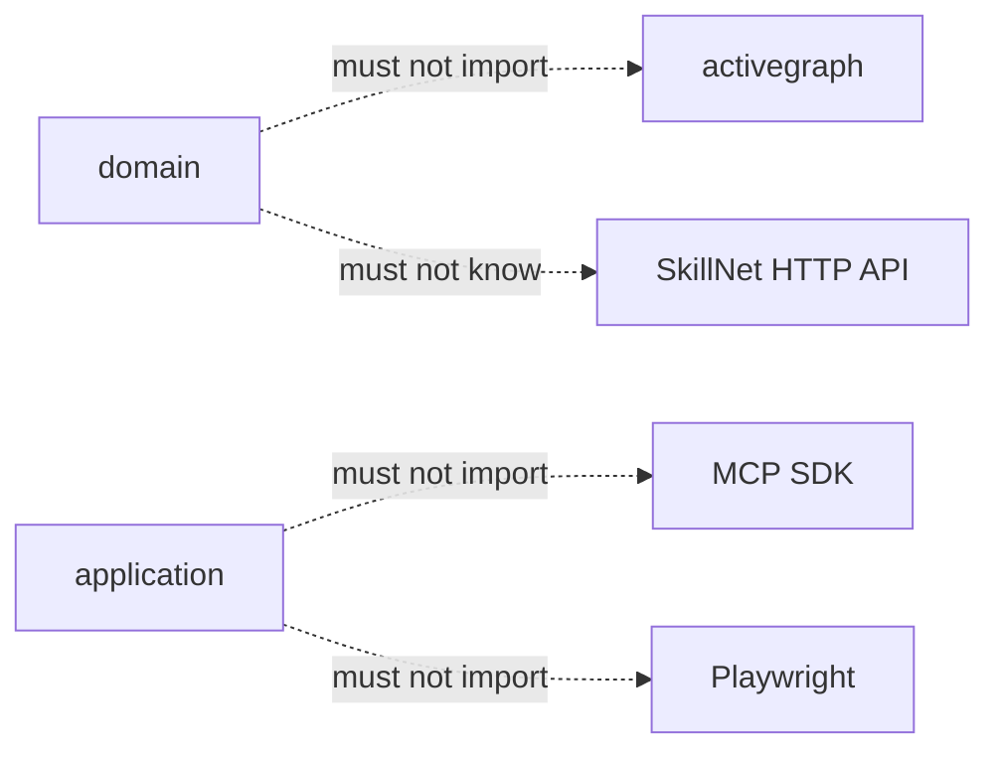
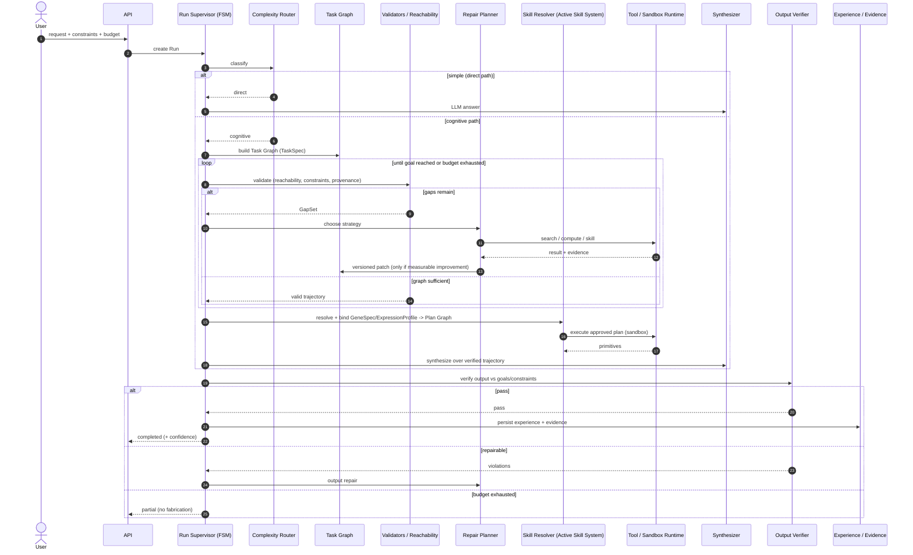

# Unified Runtime Architecture Specification

> Synthesis of `doc/idea.md` (Active Skill System) and `doc/concept.md`
> (SymFSM-like Cognitive Runtime) into one specification for a project that
> combines an Active Skill System with a Cognitive Runtime under a **Unified
> runtime** center of gravity. ActiveGraph's role is grounded in the real
> implementation (`github.com/yoheinakajima/activegraph`, re-verified at
> `27c2901b`); see `doc/activegraph-claims.md` for the per-claim verdicts.
>
> Status: architecture/research artifact (M001-pgyf3y / S02). No production
> code. `doc/idea.md` and `doc/concept.md` are **inputs** and are left
> untouched.

## 1. Center of gravity

The system is a **Unified runtime**. The **Cognitive Runtime** is the
top-level request/control plane; the **Active Skill System** is the typed
skill/expression subsystem that lives *inside* it. ActiveGraph is an
external **adapter and composition root**, not the home of domain logic.

Unified architectural formula (merging the two sources):

```text
Unified Runtime =
    Cognitive Control Plane            # concept.md §2: top-level control loop
  + Semantic Layer (Task Graph)        # concept.md §4.1: what is known/required
  + Reasoning Layer (Plan Graph, Run FSM, validators, repair)
                                       # concept.md §4.2/§4.3/§6/§7
  + Execution Layer (Skill + Tool Runtime, Sandbox, Output Verifier)
                                       # concept.md §10 + idea.md §5/§12
  + Active Skill System (Genome, Expression, Evolution, Governance)
                                       # idea.md §3: typed skill/expression
  + ActiveGraph adapter (event log, projection, fork/diff)  # S01-verified
```

The governing invariant, inherited from both sources, is:

> **Structurally correct ≠ factually true.** Structural validity, provenance,
> constraint satisfaction, tool results, and output-vs-model conformance are
> all checked independently. An LLM may not self-promote a statement from
> `PROPOSED` to `VERIFIED` (concept.md §8).

### How the two source models compose

| idea.md (skill/expression) | concept.md (runtime) | Unified role |
|---|---|---|
| GeneSpec | (portable spec consumed by runtime) | the *what* a skill declares |
| ExpressionProfile | Task/Plan binding context | the *where* a skill is applicable |
| BindingInstance + CompiledPlan | Plan Graph | the *how* a skill executes |
| Evaluation evidence / Evolution | Evidence Ledger + Experience Store | the *whether* it worked + offline improvement |
| Governance (Trust/Risk/Policy) | Policy Engine + Approval | the *authority* to act |
| ActiveGraph pack | adapter/composition root | the *what actually happened* + replay/fork |

## 2. Layering

Direction of dependencies is inward (onion); connectivity is via ports/adapters (hexagonal). ActiveGraph packs sit in the **driving adapters / composition roots** layer, not inside the domain.



Forbidden dependencies (enforced as project rules, not framework guarantees):

```text
domain        -.- must not import -> ActiveGraph
application   -.- must not import -> MCP SDK / Playwright
domain        -.- must not know   -> SkillNet HTTP API
```

## 3. Context (C4 level 1)



**Cognitive Runtime (the Unified Runtime)** is the control plane. LLMs, tools,
RAG and ActiveGraph are **executors/adapters**, not owners of global logic —
mirroring concept.md §2's Cognitive Control Plane.

## 4. Domain model and bounded contexts

The Active Skill System (idea.md §3) becomes four bounded contexts that the
Cognitive Runtime (concept.md §3-§4) hosts. Dependencies point inward:
Genome knows nothing about the runtime; Governance constrains Expression and
Evolution.



### 4.1 Genome (what a skill is)

Immutable, portable spec. Sits in the domain; knows nothing about the runtime,
graph, MCP, browser, or evaluator.

```text
GeneSpec / Fragment / Primitive / DataContract / EffectContract /
Invariant / Signature / Lineage
```

This is the portable artifact the Cognitive Runtime's Skill Resolver binds into
a concrete environment. New version => new immutable content hash.

### 4.2 Expression (where a skill applies)

Maps a GeneSpec onto an environment's structure. `ExpressionProfile`
generalizes idea.md §6-§8's TIP; `ContextSignature` is a typed attributed
graph pattern (the browser accessibility tree is just one adapter).

```text
ExpressionProfile / ContextSnapshot / ContextSignature / Affordance /
BindingProposal / BindingInstance / CompiledPlan / OutcomeContract
```
The Cognitive Runtime's Task Graph (concept.md §4.1) is the surface Expression
binds against: goals/constraints/claims/gaps become the slots a profile fills.

### 4.3 Evolution (whether it worked + offline improvement)

Variation/selection as a *policy*, not a runtime:
```text
FailureDiagnosis / MutationCandidate / Experiment / EvaluationEvidence /
Frontier / PromotionDecision / Regression
```
Maps onto concept.md §11-§12's Experience Store + offline evolution loop.
Mutations are accepted only after independent evaluation, never because the
LLM thinks they are better.

### 4.4 Governance (authority to act)

```text
TrustPolicy / RiskPolicy / Approval / Revocation / ExecutionAuthority /
PromotionPolicy
```
Base effect/safety policy is part of the mandatory kernel (not an optional
pack). This maps onto concept.md's Policy Engine + Approval gateway and onto
the new ActiveGraph `PendingApproval` primitive (S01 C15, see section 8).

### 4.5 Runtime models hosting the skill system

concept.md's three independent models resolve the public SymFSM ambiguity
("concept / process-state / action must not be one entity"):

| concept.md model | Answers | Maps to skill-system concept |
|---|---|---|
| **Task Graph** (§4.1) | what must be proven/obtained | Expression binding target |
| **Plan Graph** (§4.2) | what to execute to close gaps | CompiledPlan / BindingInstance |
| **Run FSM** (§4.3) | which phase the request is in | execution coordination |

### 4.6 Container diagram (C4 level 2)



## 5. Hexagonal and onion boundaries

The two architectures are complementary (idea.md "Краткий вывод"):

- **Onion** sets the direction: everything depends inward (infrastructure ->
  application -> domain).
- **Hexagonal** sets the connection style: ActiveGraph, SkillNet, MCP, API,
  browser, filesystem, graph DB, sandbox and evaluator plug in through
  **ports and adapters**. The application must run without a UI, database or
  specific device; technology adapters translate external events into
  semantic application calls.

### 5.1 Ports

Incoming (use cases, idea.md §5.1 — concept.md control layer):

```text
RegisterGene / PrepareExpression / ExecuteApprovedPlan /
VerifyOutcome / DiagnoseFailure / EvaluateCandidate / PromoteCandidate
```

Outgoing (idea.md §5.2), grouped by the Cognitive Runtime component that uses
them:

| Group | Ports |
|---|---|
| Repositories | GeneRepository, ExpressionProfileRepository, EvaluationEvidenceRepository |
| Observation | ContextObserver, CapabilityCatalog, PatternIndex, GroundingEngine |
| Execution | PrimitiveExecutor, ArtifactStore, SandboxRuntime, OutcomeVerifier |
| Trust | TrustStore, SignatureVerifier, PolicyGate, ApprovalGateway |
| External | SkillRegistryGateway, ExperimentWorkspace, ModelGateway, Clock, IdGenerator |

Possible adapters (idea.md §5.3), e.g. `ExperimentWorkspace -> ActiveGraph
forks`, `ContextObserver -> Browser / OpenAPI / MCP / Git / SQL / ActiveGraph`.

### 5.2 Forbidden dependencies

Enforced as **project rules** (the domain/application libraries are plain
Python; nothing in the framework makes these impossible, so they are checked by
dependency tests):



### 5.3 Pack is not a layer

A pack is a **deployable capability**, not an onion layer (idea.md §2). The
correct split is a clean domain/application library plus separate ActiveGraph
packs by bounded context / trust boundary / deployment profile:

```text
active-skill-core                  # plain Python domain + application library
activegraph-skill-kernel-pack      # ActiveGraph adapter + composition root
activegraph-skill-evolution-pack   # optional capability
activegraph-skill-governance-pack  # optional capability (approvals/trust)
activegraph-expression-*-pack      # optional modalities (web/api/repo/data)
```

### 5.4 ActiveGraph adapter role (grounded in S01)

ActiveGraph realizes several external adapters at once (S01 verdicts,
`doc/activegraph-claims.md`, commit `27c2901b`):

- **Inbound adapter (verified, C5/C6/C12):** behaviors are thin event-driven
  adapters — `@behavior(on=[...], creates=[...])`, signature
  `(event, graph, ctx) -> None` (CONTRACT #6). A behavior only deserializes,
  calls a use case, serializes — no skill search, promotion, type checking,
  grounding, direct HTTP, or evolution heurics inside it.
- **Outbound adapter (verified, C10/C16):** `ExperimentWorkspace` is realized
  through ActiveGraph fork/diff (`Runtime.fork`, `runtime/runtime.py:2338-2472`);
  read-model/workspace ports read the graph projection.
- **Pack as adapter bundle (verified, C2/C3):** `Pack` bundles object/relation
  types, behaviors, tools, policies, prompts; loaded at runtime, idempotent on
  name+version.

## 6. Data and control flow

The Run FSM (concept.md §4.3) drives the request lifecycle; the main workflow
(concept.md §5) is the control flow; the Active Skill System binds into the
execution phase. The full flow merges concept.md's supervisor logic with
idea.md's grounding/execution model.



### 6.1 Control states (Run FSM)

The FSM (concept.md §4.3) governs lifecycle without encoding every concept as a
state:

```text
received -> classifying
  classifying -> direct_path (simple) | modeling (complex)
  direct_path -> synthesizing
  modeling -> validating_model
    validating_model -> planning | repairing (gaps) | partial (budget)
    repairing -> validating_model | waiting_input | waiting_approval
      waiting_approval -> planning (approved) | partial (rejected)
  planning -> executing
    executing -> validating_model (new data) | repairing (action error) | synthesizing (plan done)
  synthesizing -> validating_output
    validating_output -> completed | repairing | partial | failed
terminal: completed | partial | failed | cancelled
```

### 6.2 Anti-fantasy gating (concept.md §8-§9)

A node enters the final answer only if it is: evidenced, or derived by a
deterministic computation, or produced by a registered rule, or explicitly
marked as a hypothesis, or is a formulation (not a factual claim). Repair never
"imagines the missing piece" — it classifies the gap and takes a bounded
action (concept.md §7), and a graph patch is accepted only on measurable
improvement (critical gaps down / reachability up) without worsening
hard-constraint violations or risk.

## 7. ActiveGraph integration (grounded in S01)

ActiveGraph is the **adapter + composition root + durable execution
substrate**. Every claim below is tied to a verdict in
`doc/activegraph-claims.md` (repo re-verified at `27c2901b`).

### 7.1 What ActiveGraph provably provides

| Capability | Verdict | Source |
|---|---|---|
| Pack = object/relation types, behaviors, tools, policies, prompts | verified (C2/C3) | `activegraph/packs/__init__.py:530-621` `class Pack`; loader idempotent on name+version |
| Event-driven thin behaviors | verified (C5/C6/C12) | `@behavior(on=,creates=)`, signature `(event,graph,ctx)` |
| Append-only event log = execution history | verified (C7/C14) | `store/base.py:EventStore` (append-only per-run log) |
| Graph = projection / read-model rebuilt from log | verified (C8) | `replay_into` / `Graph._replay_event` (used by load + fork) |
| Replay determinism (caches, divergence detection, deterministic IDs) | verified (C9/C13) | `LLMCache/ToolCache.from_events`; `ReplayDivergenceError`; `IDGen.reseed_from_events` |
| Fork/diff for experiment workspace | verified (C10/C16) | `Runtime.fork` (`runtime/runtime.py:2338-2472`): copies parent prefix, rebuilds projection + caches, diverges after branch point |
| Approval primitive | new (C15) | `PendingApproval` (`activegraph/packs/__init__.py:957-971`) |

### 7.2 What ActiveGraph does NOT provide (mismatches the synthesis honors)

1. **No "frames reconverge" — C11 REFUTED.** `activegraph/frame.py:Frame` is
   mission context (goal / id / constraints / success_criteria / permissions),
   NOT a short-lived reconverging branch. **Fork is the only branching
   primitive** (with `diff` for comparison). The skill-system must NOT model
   "reconverging experiment branches" as an activegraph feature.
2. **Composition-root role is a project rule, not a framework guarantee (C1/C4).**
   The framework bundles logic in packs and lets behaviors act as adapters, but
   does not enforce "pack = external composition root; no business logic in
   behaviors". Enforce via dependency tests + review.
3. **Fork-for-experiments is a governance rule (C15).** Forks are isolated from
   their parent but forking any run is not prevented. Wire this rule through
   the new `PendingApproval` primitive rather than asserting it from nothing.

### 7.3 Integration boundary

- The **domain** (Active Skill System) never imports ActiveGraph.
- The **activegraph adapter pack** maps domain events <-> ActiveGraph events
  (`skill.expression.requested` etc.), exposes the outbound ports
  (`EventJournalPort`, `WorldProjectionPort`, `ExperimentWorkspacePort`,
  `TraceReaderPort`) over the verified event log + projection + fork/diff.
- `ExperimentWorkspacePort` is realized by `Runtime.fork` + `compute_diff`;
  `WorldProjectionPort` / `TraceReaderPort` read the graph projection.

## 8. Requirements

Reconciles concept.md's functional/non-functional requirements (F-01..F-28)
and idea.md's architectural rules into the unified runtime contract.

### 8.1 Functional — core (P0)

| ID | Requirement (unified) | Source |
|---|---|---|
| F-01 | Accept request, constraints, result format, budget | concept F-01 |
| F-02 | Convert request into a validable TaskSpec | concept F-02 |
| F-03 | Build a typed Task Graph (Expression binding target) | concept F-03 + idea Expression |
| F-04 | Version graph changes (immutable committed versions) | concept F-04 |
| F-05 | Check goal reachability | concept F-05 |
| F-06 | Detect missing evidence, contradictions, constraint violations | concept F-06 |
| F-07 | Run a bounded repair loop (measurable-improvement gate) | concept F-07 + §7 |
| F-08 | Plan tool calls only for concrete gaps | concept F-08 |
| F-09 | Persist provenance of every external result | concept F-09 |
| F-10 | Verify the final answer against goals/constraints | concept F-10 |
| F-11 | Support partial result on budget exhaustion (no fabrication) | concept F-11 |
| F-12 | Record a full audit/event log (ActiveGraph EventStore) | concept F-12 + C7 |
| F-13 | Support cancellation + idempotency | concept F-13 |
| F-14 | Require approval for irreversible actions | concept F-14 + PendingApproval (C15) |

### 8.2 Functional — evolution/governance (P1)

| ID | Requirement | Source |
|---|---|---|
| F-17 | Typed Skill Registry (GeneSpec/ExpressionProfile) | idea Genome/Expression |
| F-19 | Experience retrieval by task signature | concept F-19 + idea Evolution |
| F-22 | Versioning of prompts, policies, ontologies, skills | idea prompts/policies; replay contract C9 |
| F-23 | Offline evolution of skills + repair policies (no online self-change) | idea Evolution + concept §12 |

### 8.3 Architectural rules (idea.md §16, unified)

1. Packs are trusted code; genes/profiles are untrusted data.
2. Domain knows nothing about ActiveGraph.
3. Behaviors are thin inbound adapters (no business logic).
4. ActiveGraph object graph is a projection; the event log is the execution history.
5. No direct I/O in behaviors (replay/fork reproducibility, C13).
6. Any external change first becomes an `EffectIntent`.
7. ExpressionProfile determines applicability, not authority.
8. BindingInstance is local, never published as a GeneSpec.
9. New GeneSpec version => new immutable content hash.
10. Fork applies to experiments only (governance rule, C15).

### 8.4 Non-functional highlights

- **Reliability:** graph mutations are transactional; every patch is
  reversible; runs recover from event log + graph snapshots (C14).
- **Reproducibility:** full replay captures model/prompt/policy/ontology/
  skill/tool versions + input/evidence hashes + deterministic IDs (C13).
- **Security:** secrets never enter prompts/graph/event payload; sandbox network
  is allowlisted; irreversible ops require policy gate + approval (PendingApproval).
- **Observability:** per-run state transitions, graph versions, gaps, repair
  cycles, tool/provider calls, token usage, cost, latency, constraint
  violations, output validation, approvals, errors are all recorded.
