# Спецификация аналога SymFSM для собственного проекта

Официальная концепция сводится к цепочке:

```text
Запрос → когнитивная карта → проверка достижимости → repair → выполнение → синтез → проверка
```

Сайт также заявляет рекурсивные подкарты, накопление успешных траекторий и разделение ролей: LLM понимает и формулирует, а внешний слой контролирует структуру решения. ([principium.pro][1])

Для реализации лучше не копировать SymFSM буквально, а разделить систему на три независимые модели:

1. **Task Graph** — что известно, что требуется и какие существуют зависимости.
2. **Plan Graph** — какие действия необходимо выполнить, чтобы закрыть пробелы.
3. **Run FSM** — в какой фазе обработки находится запрос.

Это устраняет главную неоднозначность публичной концепции: понятие, состояние процесса и действие не должны быть одной сущностью.

---

# 1. Кристаллизованная идея

> **Система превращает запрос пользователя в типизированную модель задачи, проверяет возможность достижения цели, устраняет структурные и информационные пробелы, выполняет только обоснованные действия и генерирует ответ из проверенного состояния.**

Формула системы:

```text
Cognitive Runtime =
    Task IR
  + Semantic Graph
  + Workflow FSM
  + Validators
  + Repair Controller
  + Tool/Skill Runtime
  + Evidence Ledger
  + Output Synthesizer
  + Experience/Evaluation Loop
```

Главное ограничение:

```text
структурно корректно ≠ фактически истинно
```

Поэтому система должна проверять одновременно:

* структуру рассуждения;
* происхождение фактов;
* выполнение ограничений;
* результат инструментов;
* соответствие финального ответа построенной модели.

---

# 2. Архитектурный контекст

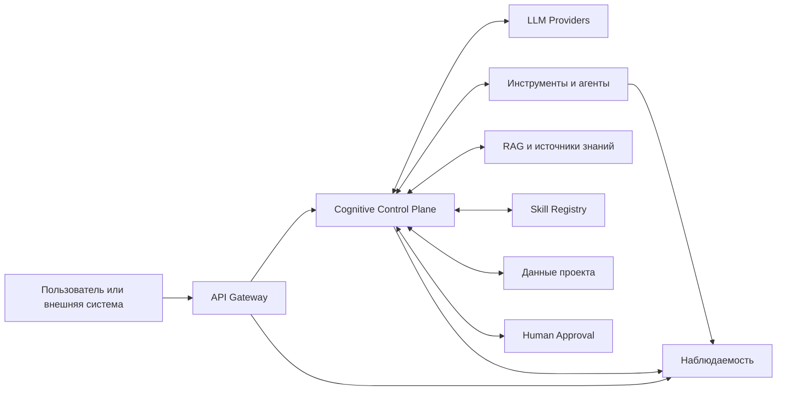

**Cognitive Control Plane** является управляющим контуром. LLM, RAG, инструменты и агенты — исполнители, а не владельцы глобальной логики.

---

# 3. Логическая архитектура

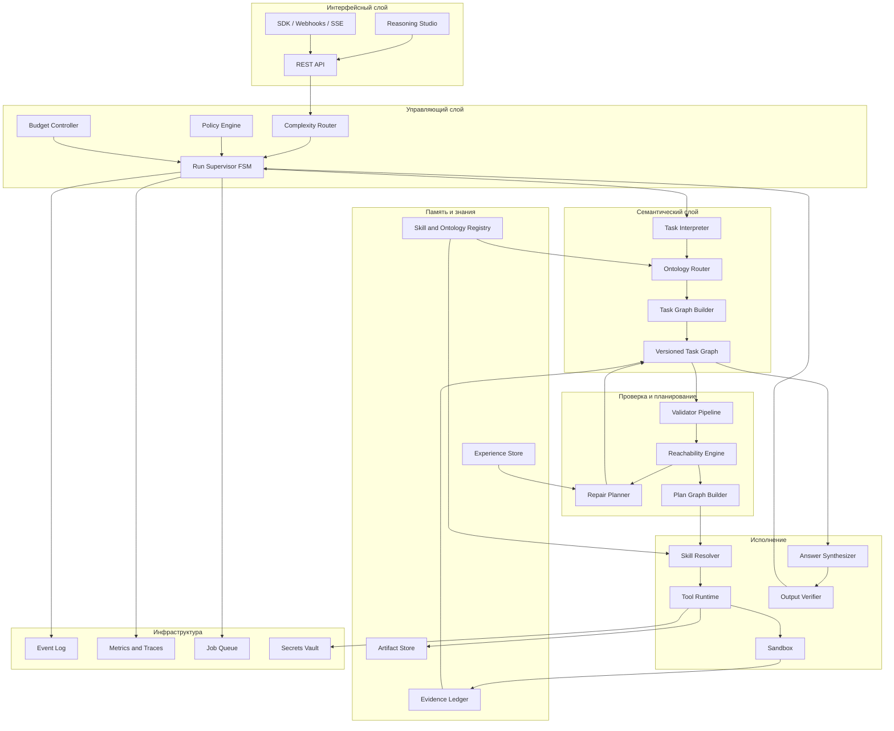

---

# 4. Разделение моделей

## 4.1. Task Graph

Описывает предметную структуру задачи:

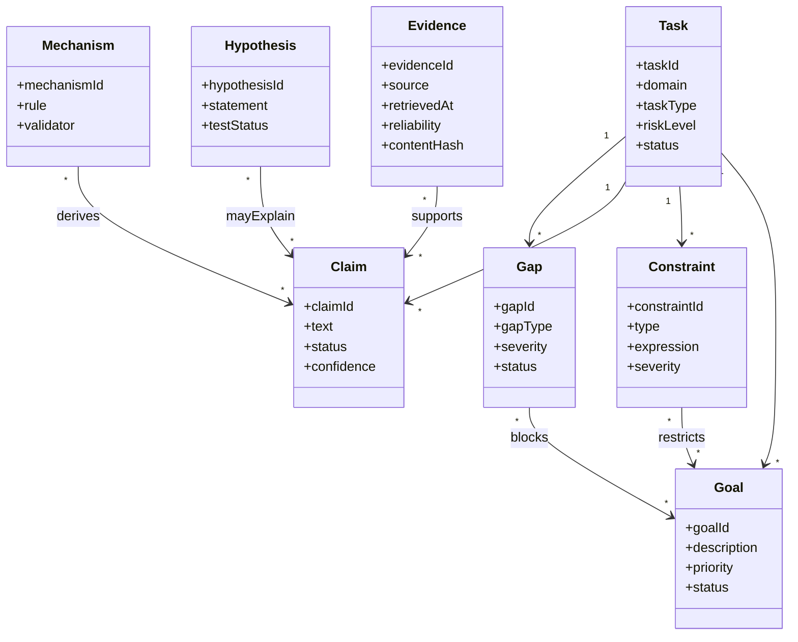

### Минимальные типы узлов

| Тип          | Назначение                        |
| ------------ | --------------------------------- |
| `Goal`       | Требуемый результат               |
| `Fact`       | Принятое исходное утверждение     |
| `Evidence`   | Проверяемый источник факта        |
| `Constraint` | Жёсткое или мягкое ограничение    |
| `Hypothesis` | Непроверенное предположение       |
| `Mechanism`  | Правило получения нового вывода   |
| `Unknown`    | Недостающая информация            |
| `Decision`   | Выбор между альтернативами        |
| `Action`     | Необходимое внешнее действие      |
| `Result`     | Результат действия или вычисления |

### Основные типы связей

```text
SUPPORTS
REQUIRES
DERIVED_FROM
CAUSES
CONTRADICTS
BLOCKS
SATISFIES
REFINES
DEPENDS_ON
PRODUCES
INVALIDATES
```

---

## 4.2. Plan Graph

Task Graph отвечает на вопрос **«что должно быть доказано или получено?»**.

Plan Graph отвечает на вопрос **«что выполнить для этого?»**.

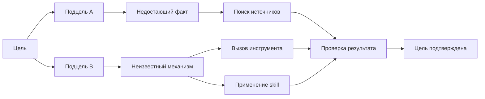

---

## 4.3. Run FSM

FSM управляет **жизненным циклом запроса**, но не пытается представить каждое понятие отдельным состоянием.

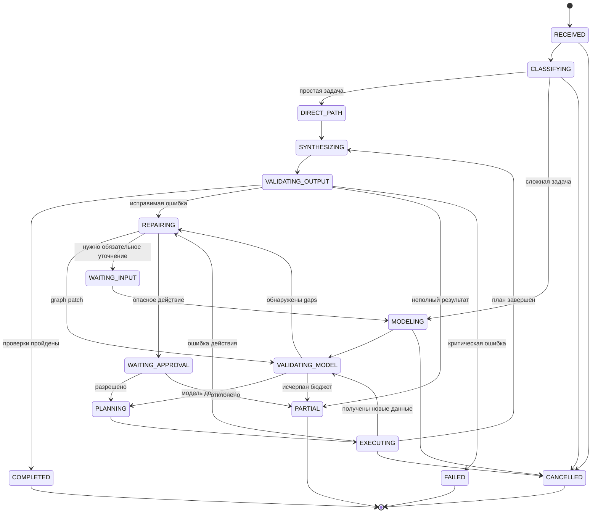

---

# 5. Основной workflow

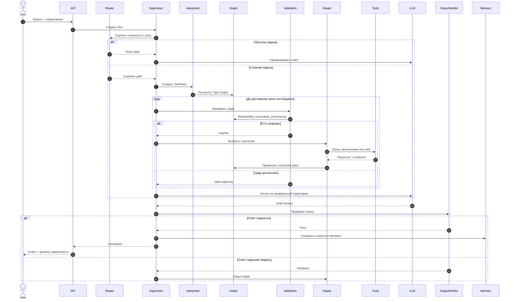

---

# 6. Логика достижимости

Цель считается достижимой только при выполнении всех условий:

```text
1. Существует путь от принятых фактов или evidence к цели.
2. Каждый переход использует известный механизм или правило.
3. Все обязательные входы механизма доступны.
4. Жёсткие ограничения не нарушены.
5. На пути нет нерешённого критического противоречия.
6. Фактические утверждения имеют provenance.
7. Непроверенные предположения явно маркированы.
```

Упрощённо:

```text
reachable(goal) =
    exists valid_path(start_nodes, goal)
    and all_guards_satisfied(path)
    and all_hard_constraints_satisfied(path)
    and no_critical_gap(path)
```

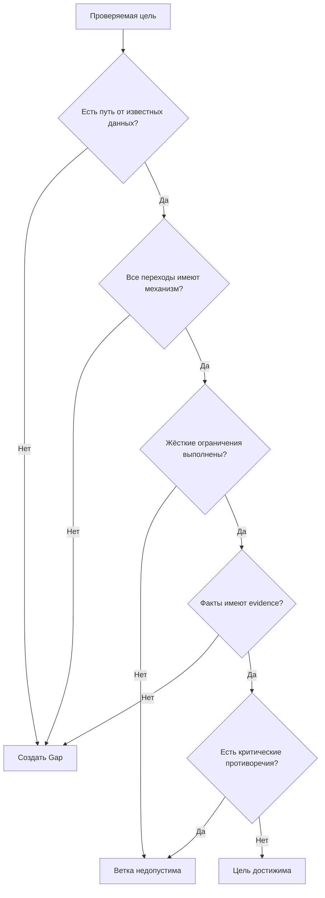

---

# 7. Repair-механика

Repair не должен «додумывать недостающее». Он должен определить класс проблемы и выбрать ограниченное действие.

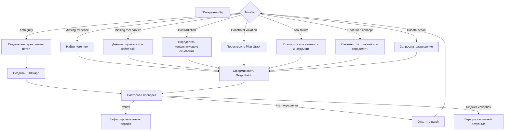

## Классы repair-операций

| Gap                                           | Действие                         |
| --------------------------------------------- | -------------------------------- |
| Не хватает факта                              | RAG, поиск, база данных, API     |
| Не хватает механизма                          | Skill retrieval или декомпозиция |
| Неоднозначность                               | Создание нескольких ветвей       |
| Противоречие                                  | Сравнение provenance и доверия   |
| Недостаточная детализация                     | Подкарта для локального узла     |
| Нарушение ограничения                         | Перепланирование                 |
| Ошибка инструмента                            | Retry, fallback, substitute      |
| Нет обязательного пользовательского параметра | Clarification                    |
| Ответ не соответствует графу                  | Локальная регенерация            |

## Обязательные ограничители

```yaml
repair_policy:
  max_cycles: 5
  max_subgraph_depth: 3
  max_parallel_branches: 4
  max_tool_calls: 20
  max_total_tokens: configurable
  max_wall_clock: configurable
  loop_detection: true
  minimum_graph_improvement: required
```

Repair должен приниматься только при измеримом улучшении:

```text
новая версия графа принимается, если:

critical_gaps уменьшились
или reachability выросла
или число подтверждённых целей увеличилось

при этом:
hard_constraint_violations не выросли
risk_score не ухудшился
```

---

# 8. Жизненный цикл утверждения

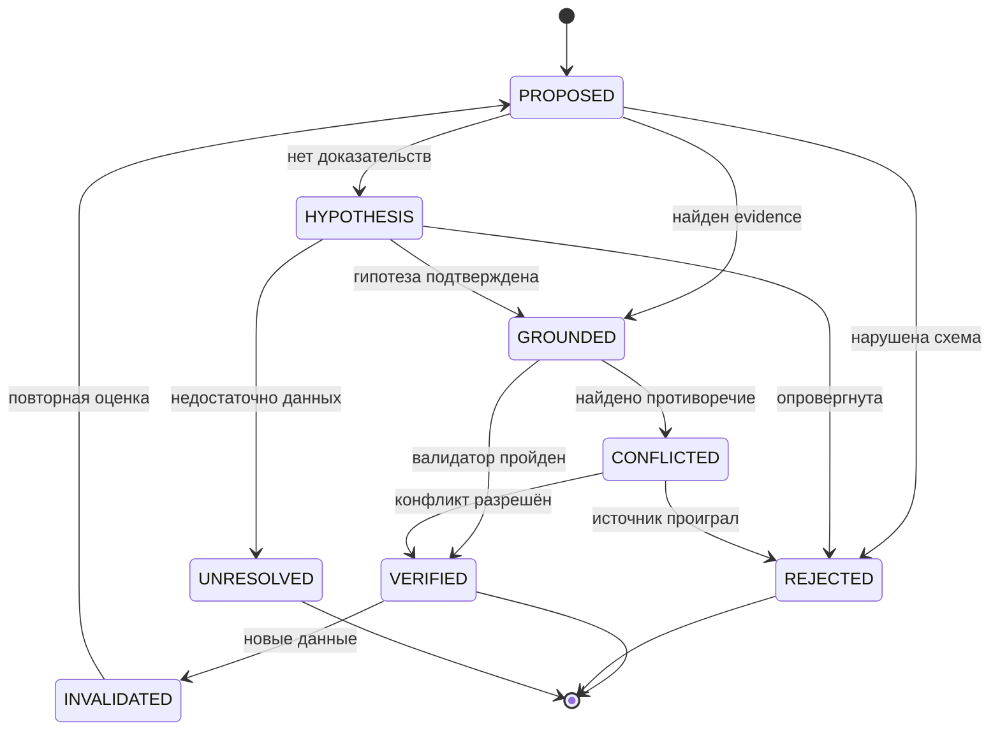

Критическое правило:

> LLM не может самостоятельно перевести своё утверждение из `PROPOSED` в `VERIFIED`.

Для этого требуется хотя бы один независимый механизм:

* детерминированный валидатор;
* внешний источник;
* вычисление;
* инструмент;
* доменное правило;
* human approval.

---

# 9. Anti-Fantasy как формальная политика

Узел разрешается включить в финальный ответ, если выполнено хотя бы одно условие:

```text
1. Узел подтверждён evidence.
2. Узел получен детерминированным вычислением.
3. Узел выведен через зарегистрированное правило.
4. Узел явно маркирован как предположение.
5. Узел является формулировкой, а не фактическим утверждением.
```

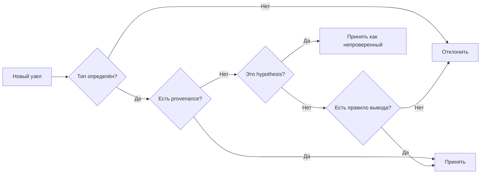

---

# 10. Интеграция агентов, инструментов и skills

Агенты и инструменты должны подключаться через типизированный контракт, а не через свободный текст.

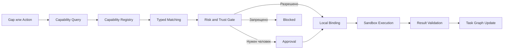

Для проектного развития разумно синтезировать это со SkillGenome-подходом:

* передавать декларативную спецификацию навыка, а не произвольный код;
* типизировать вход и выход;
* разделять переносимую спецификацию и локальную привязку;
* подписывать внешние skills;
* выполнять локальную оценку и risk gate;
* запускать действия в sandbox. 

## Минимальный SkillSpec

```yaml
skill:
  id: research.compare_sources
  version: 1.0.0

  input_schema:
    type: object
    required: [question, sources]

  output_schema:
    type: object
    required: [findings, conflicts, citations]

  capabilities:
    - http.read
    - document.parse

  side_effects:
    external_calls: true
    writes: false
    irreversible: false

  risk:
    level: low

  execution:
    runtime: local
    sandbox: required

  verification:
    validators:
      - schema
      - citation_coverage
      - source_consistency
```

---

# 11. Накопление опыта без хранения скрытых рассуждений

Сохранять следует не внутренний поток размышлений модели, а структурированные операционные объекты:

```text
Task signature
Graph pattern
Gap classes
Repair actions
Tool results
Accepted trajectory
Rejected branches
Constraint violations
Output verification result
Cost and latency
User feedback
```

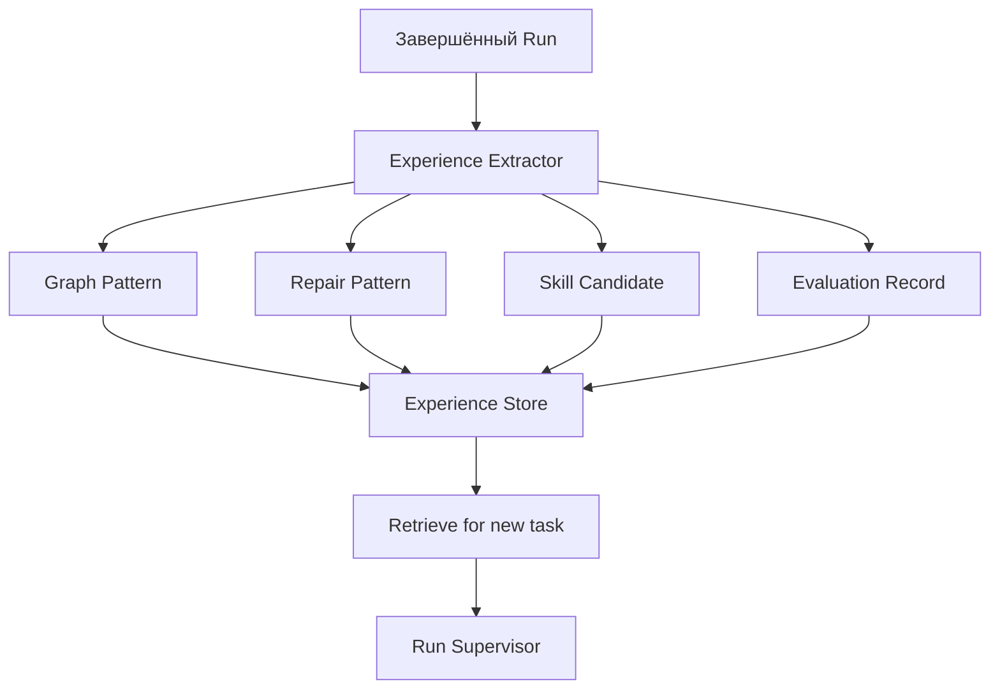

---

# 12. Контур эволюции системы

Эволюция должна происходить **офлайн**, через benchmark и promotion gate, а не посредством неконтролируемого самоизменения production-системы.

SkillNet и EvoSkill хорошо дополняют такой подход: registry предоставляет поиск, граф зависимостей и quality gates, а эволюционный контур анализирует ошибки, создаёт варианты и проверяет их на held-out задачах. 

Более точная модель оптимизации — не «обучение нейросети», а validation-gated local search:

```text
failure analysis
→ mutation
→ evaluation
→ selection
→ promotion
```

То есть изменения принимаются только после независимой проверки, а не потому, что LLM считает их улучшением. 

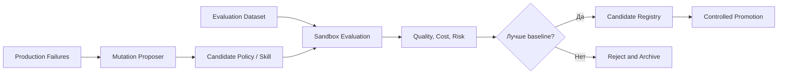

### Запрещённый контур

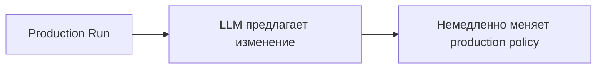

Такой механизм создаёт дрейф поведения, benchmark overfitting и нерегулируемое изменение security policy.

---

# 13. Потоки данных и хранилища

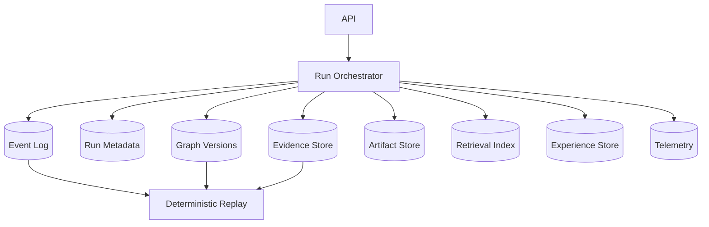

## Практическая стратегия хранения

Для MVP не требуется отдельная graph database.

Достаточно:

```text
PostgreSQL
├── runs
├── run_events
├── graph_nodes
├── graph_edges
├── graph_versions
├── evidence
├── tool_calls
├── validations
├── approvals
└── skill_specs

Object Storage
├── документы
├── tool artifacts
├── отчёты
└── большие snapshots

Vector Index
├── evidence retrieval
├── pattern retrieval
└── skill retrieval
```

Graph database следует добавлять, когда основная нагрузка действительно смещается к:

* поиску путей;
* графовой композиции skills;
* анализу lineage;
* dependency resolution;
* большим многосвязным картам.

---

# 14. API-контракт

Публичный пример SymFSM ограничивается асинхронными `POST /submit` и `GET /result`, со статусами `queued`, `running`, `done`, `error`. Сам репозиторий обозначен как исследовательский прототип. ([GitHub][2])

Для собственной системы нужен более полный контракт.

```text
POST   /v1/runs
GET    /v1/runs/{run_id}
POST   /v1/runs/{run_id}/cancel

GET    /v1/runs/{run_id}/events
GET    /v1/runs/{run_id}/graph
GET    /v1/runs/{run_id}/plan
GET    /v1/runs/{run_id}/artifacts

POST   /v1/runs/{run_id}/input
POST   /v1/runs/{run_id}/approvals
POST   /v1/runs/{run_id}/feedback

GET    /v1/skills
POST   /v1/skills
POST   /v1/skills/{skill_id}/evaluate

GET    /v1/policies
GET    /v1/ontologies
```

## Статусы Run

```text
received
classifying
modeling
validating_model
repairing
waiting_input
waiting_approval
planning
executing
synthesizing
validating_output
completed
partial
failed
cancelled
```

## Событийный поток

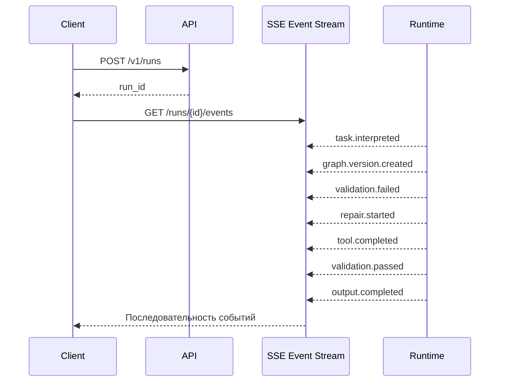

---

# 15. Функциональные требования

## P0 — обязательное ядро

| ID   | Требование                                                          |
| ---- | ------------------------------------------------------------------- |
| F-01 | Принимать запрос, ограничения, формат результата и бюджет           |
| F-02 | Преобразовывать запрос в валидируемый `TaskSpec`                    |
| F-03 | Строить типизированный Task Graph                                   |
| F-04 | Версионировать изменения графа                                      |
| F-05 | Проверять достижимость целей                                        |
| F-06 | Обнаруживать missing evidence, contradiction и constraint violation |
| F-07 | Запускать ограниченный repair-loop                                  |
| F-08 | Планировать вызовы инструментов только для конкретных gaps          |
| F-09 | Сохранять provenance каждого внешнего результата                    |
| F-10 | Проверять финальный ответ относительно целей и ограничений          |
| F-11 | Поддерживать partial result при исчерпании бюджета                  |
| F-12 | Записывать полный audit/event log                                   |
| F-13 | Поддерживать отмену и идемпотентность запросов                      |
| F-14 | Требовать approval для необратимых действий                         |

## P1 — развитие

| ID   | Требование                                             |
| ---- | ------------------------------------------------------ |
| F-15 | Рекурсивные подкарты                                   |
| F-16 | Доменный ontology routing                              |
| F-17 | Типизированный Skill Registry                          |
| F-18 | Streaming событий и визуализация графа                 |
| F-19 | Experience retrieval по сигнатуре задачи               |
| F-20 | Детерминированные domain validators                    |
| F-21 | Политики стоимости, latency и риска                    |
| F-22 | Версионирование prompts, policies, ontologies и skills |

## P2 — исследовательский контур

| ID   | Требование                                      |
| ---- | ----------------------------------------------- |
| F-23 | Offline evolution skills и repair policies      |
| F-24 | Graph-based skill composition                   |
| F-25 | Автоматический поиск альтернативных планов      |
| F-26 | Pareto selection по качеству, стоимости и риску |
| F-27 | Cross-agent skill portability                   |
| F-28 | Process mining успешных траекторий              |

---

# 16. Нефункциональные требования

## Надёжность

* Все операции изменения графа транзакционные.
* Каждый GraphPatch может быть отменён.
* Повторный запрос с тем же idempotency key не создаёт второй Run.
* Ошибка одного инструмента не уничтожает состояние задачи.
* Run можно восстановить из event log и graph snapshots.

## Безопасность

* Секреты не попадают в prompts, graph или event payload.
* Инструменты получают краткоживущие credentials.
* Сетевой доступ sandbox ограничивается allowlist.
* Необратимые операции требуют policy gate и approval.
* Загруженные skills проходят подпись, schema validation и локальный eval.
* Tenant data логически и физически изолированы согласно модели развёртывания.

## Наблюдаемость

Для каждого Run фиксируются:

```text
state transitions
graph versions
gaps
repair cycles
tool calls
provider calls
token usage
latency
cost
constraint violations
output validation
approvals
errors
```

## Воспроизводимость

Полный replay должен включать:

```text
model identifier
prompt version
policy version
ontology version
skill version
tool version
input hashes
evidence hashes
random seed, если применим
```

## Производительность

Нужны отдельные бюджеты для:

```text
simple path
cognitive path
tool execution
repair
output verification
```

Система не должна запускать полный когнитивный pipeline для каждого приветствия или простого фактологического запроса.

---

# 17. Complexity Router

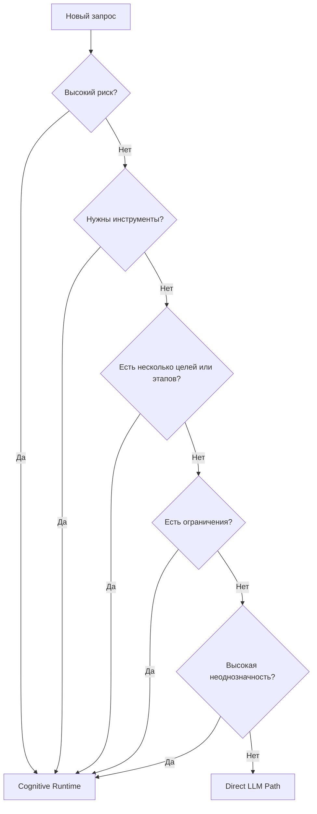

Практические признаки сложной задачи:

* несколько взаимозависимых целей;
* более одного жёсткого ограничения;
* необходимость внешних источников;
* выполнение действий;
* высокая цена ошибки;
* несколько конкурирующих решений;
* необходимость объяснимости;
* противоречивые исходные данные.

---

# 18. Эталонная логика Supervisor

```python
def execute_run(request):
    run = create_run(request)
    route = classify_complexity(request)

    if route == "direct":
        draft = generate_direct(request)
        return verify_and_finalize(run, draft)

    task_spec = interpret_request(request)
    graph = build_initial_graph(task_spec)

    while run.budget.available:
        validation = validate_graph(graph)

        if validation.is_ready:
            break

        gap = select_highest_priority_gap(validation.gaps)
        repair_action = choose_repair(gap, graph, run.policy)

        if repair_action.requires_approval:
            decision = request_approval(repair_action)
            if not decision.approved:
                mark_unresolved(gap)
                continue

        result = execute_repair(repair_action)
        patch = create_graph_patch(result)

        candidate_graph = apply_patch(graph, patch)
        candidate_validation = validate_graph(candidate_graph)

        if improves(candidate_validation, validation):
            graph = commit(candidate_graph)
        else:
            rollback(patch)

        if loop_detected(graph):
            break

    trajectory = select_valid_trajectory(graph)
    draft = synthesize_answer(task_spec, graph, trajectory)

    output_validation = validate_output(draft, graph, task_spec)

    if output_validation.passed:
        persist_experience(run, graph, trajectory)
        return complete(run, draft)

    if run.budget.available:
        return repair_output(run, draft, output_validation)

    return partial(run, draft, output_validation)
```

---

# 19. MVP-архитектура

Для первого рабочего вертикального сценария следует ограничить систему одним доменом, например:

```text
архитектурный анализ
или
исследовательский ответ с источниками
```

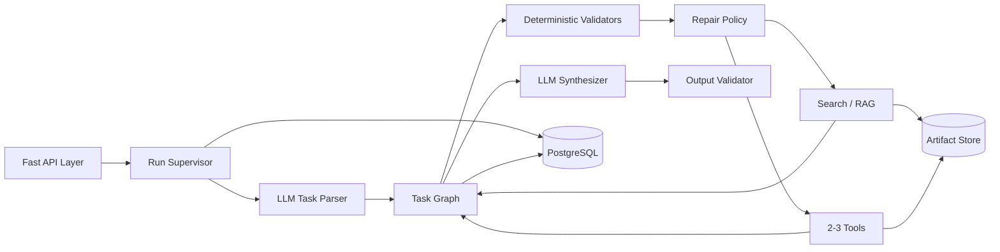

## Не включать в первый MVP

* универсальную онтологию всех доменов;
* многоагентную колонию;
* сложную 30-мерную модель состояния;
* автоматическую онлайн-эволюцию;
* произвольный исполняемый код из marketplace;
* глубокую рекурсивность;
* собственный язык логического доказательства;
* отдельную graph database без подтверждённой необходимости.

---

# 20. Этапы развития

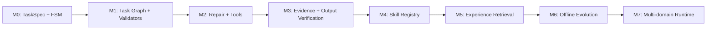

### M0

* асинхронный Run;
* FSM;
* event log;
* бюджеты;
* direct/full routing.

### M1

* схемы узлов и связей;
* versioned graph;
* reachability;
* constraint validation.

### M2

* классификация gaps;
* repair policies;
* tool adapters;
* retry/fallback;
* approval.

### M3

* provenance;
* evidence ledger;
* claim coverage;
* final output verifier.

### M4

* типизированные SkillSpec;
* local bindings;
* sandbox;
* risk gate;
* trust/signatures.

### M5

* поиск похожих graph patterns;
* reuse успешных repair;
* process metrics.

### M6

* mutation proposals;
* held-out evaluation;
* Pareto selection;
* controlled promotion.

### M7

* доменные онтологии;
* subgraphs;
* специализированные validators;
* масштабируемая графовая инфраструктура.

---

# 21. Критерии готовности

Система считается работоспособной, когда выполняются следующие инварианты:

```text
1. Каждый Run имеет воспроизводимую последовательность событий.
2. Каждая версия графа неизменяема после фиксации.
3. Каждый фактический вывод имеет provenance или статус hypothesis.
4. Каждый tool call связан с конкретным Gap или Action.
5. Ни одно необратимое действие не выполняется без policy gate.
6. Repair не может выполняться бесконечно.
7. Финальный ответ покрывает заявленные цели.
8. Нарушенные ограничения явно отражаются в результате.
9. При недостатке данных возвращается partial, а не выдуманное завершение.
10. Изменения skills и policies не попадают в production без eval.
```

## Метрики качества

| Метрика                 | Что измеряет                              |
| ----------------------- | ----------------------------------------- |
| Goal coverage           | Доля закрытых целей                       |
| Constraint compliance   | Соблюдение ограничений                    |
| Evidence coverage       | Подтверждённость фактических утверждений  |
| Repair success rate     | Доля успешно устранённых gaps             |
| Unsupported claim rate  | Неподтверждённые утверждения              |
| Tool efficiency         | Полезные вызовы относительно всех вызовов |
| Cost per successful run | Стоимость успешного решения               |
| Latency per run class   | Задержка по типам задач                   |
| Regression rate         | Деградация после изменений                |
| Human intervention rate | Частота запросов approval/clarification   |

---

# Итоговая конструкция

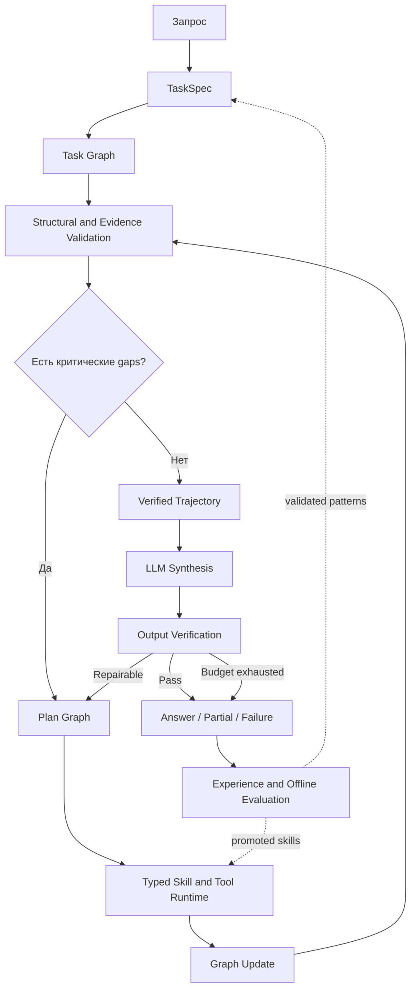

**Целевая архитектурная формула проекта:**

> **FSM управляет процессом, Task Graph моделирует проблему, Plan Graph моделирует действия, validators определяют допустимость, repair закрывает gaps, skills и инструменты исполняют план, LLM интерпретирует и формулирует, а offline evaluation улучшает систему без неконтролируемого самоизменения.**

[1]: https://principium.pro/ru/symfsm-2/ "Скачать SymFSM приложение для Windows. Официальная страница"
[2]: https://github.com/likeslines-maker/SymFSMExamples "GitHub - likeslines-maker/SymFSMExamples: From Text Generation to Computable Reasoning · GitHub"
