# Идея архитектуры Active Skill System

## Для кого этот документ

Документ предназначен для инженера, который проектирует или реализует ядро Active Skill System и его интеграцию с ActiveGraph.

После прочтения он должен уметь:

- отделить доменную модель SkillGenome от ActiveGraph pack;
- спроектировать порты, адаптеры и bounded contexts;
- понять роль `ExpressionProfile` как обобщения TIP;
- выбрать первый инкремент реализации без преждевременного дробления packs.

---

## Краткий вывод

Гексагональная и луковичная архитектуры здесь дополняют друг друга:

- **луковичная архитектура** задаёт направление зависимостей: всё зависит внутрь, от инфраструктуры к домену;
- **гексагональная архитектура** задаёт способ подключения ActiveGraph, SkillNet, MCP, API, браузера, файловой системы, graph DB, sandbox и evaluator через порты и адаптеры.

Главное правило:

> **ActiveGraph pack должен быть внешним composition root и транспортным адаптером, а не местом хранения бизнес-логики SkillGenome.**

ActiveGraph определяет pack как Python-пакет, включающий object/relation types, behaviors, tools, prompts и policies. Behaviors подписываются на события и создают новые события или изменения графа. Это хорошо подходит для внешнего реактивного слоя, но не требует помещать доменную модель внутрь behaviors. [1]

---

## 1. Общая архитектура

```mermaid
flowchart TB
    subgraph L4[Driving adapters and composition roots]
        AGP[ActiveGraph packs]
        CLI[CLI]
        API[API]
        OPS[Operators]
    end

    subgraph L3[Infrastructure adapters]
        AG[ActiveGraph]
        SN[SkillNet]
        MCP[MCP]
        EXTAPI[External APIs]
        DB[(Database)]
        BR[Browser]
        SB[Sandbox]
    end

    subgraph L2[Application layer]
        REG[Register]
        RET[Retrieve]
        ACT[Activate]
        BIND[Bind]
        EXEC[Execute]
        EVAL[Evaluate]
        DIAG[Diagnose]
        MUT[Mutate]
        FORK[Fork]
        PROM[Promote]
    end

    subgraph L1[Domain]
        GS[GeneSpec]
        EP[ExpressionProfile]
        CTX[Context]
        BI[Binding]
        FX[Effects]
        INV[Invariants]
        CAND[Candidate]
        EV[EvaluationEvidence]
        LIN[Lineage]
    end

    L4 --> L3 --> L2 --> L1
```

Направление зависимостей:

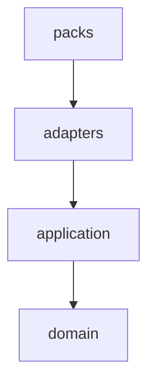

Запрещённые зависимости:

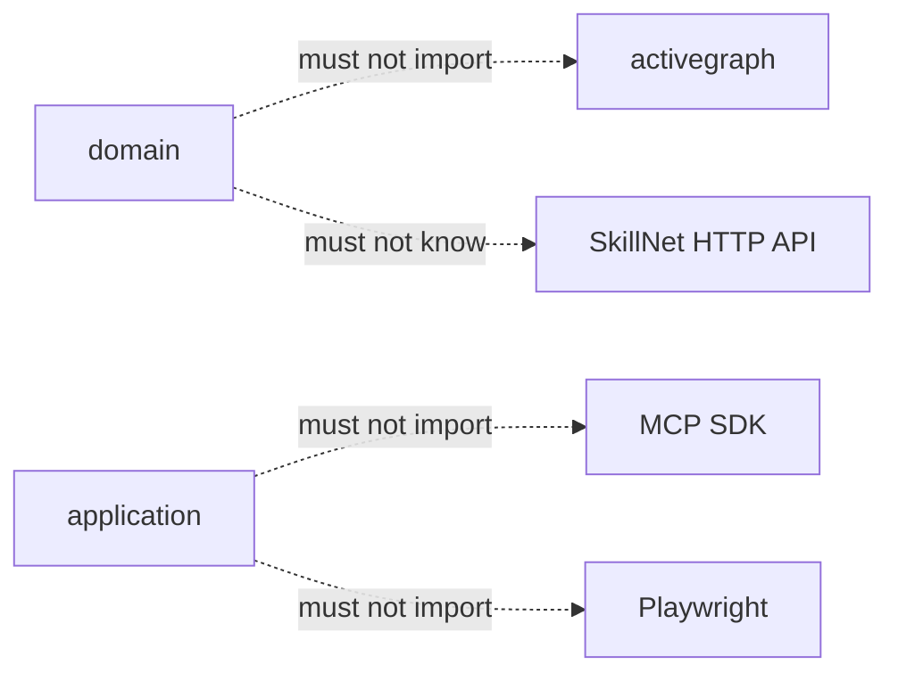

Гексагональная архитектура требует, чтобы приложение могло работать без UI, базы данных и конкретного внешнего устройства, а технологические адаптеры преобразовывали внешние события в семантические вызовы приложения. [2]

---

## 2. Pack не является архитектурным слоем

Неправильная декомпозиция:

```text
domain-pack
application-pack
infrastructure-pack
```

ActiveGraph pack — это deployable capability, а не слой onion architecture.

Правильнее:

```text
active-skill-core                  # обычная Python-библиотека
activegraph-skill-kernel-pack      # ActiveGraph integration
activegraph-skill-evolution-pack   # optional capability
activegraph-skill-web-pack         # optional modality
activegraph-skill-api-pack         # optional modality
```

Каждый pack может внутри использовать hexagonal/onion architecture, но сами packs лучше разделять по:

- bounded context;
- trust boundary;
- deployment profile;
- optional capability;
- владельцу и release cadence.

---

## 3. Bounded contexts

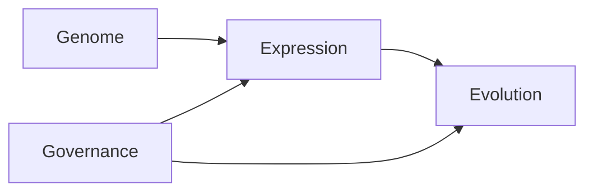

### 3.1 Genome

Отвечает за неизменяемое описание навыка:

```text
GeneSpec
Fragment
Primitive
DataContract
EffectContract
Invariant
Signature
Lineage
```

Genome не должен знать:

- где находится skill registry;
- какой graph runtime используется;
- какой MCP-сервер выбран;
- как выглядит browser snapshot;
- каким evaluator проверяется skill.

Это сохраняет основную идею SkillGenome: переносимым артефактом остаётся типизированная спецификация, а локальный runtime связывает её с возможностями среды.

### 3.2 Expression

Отвечает за применимость навыка в конкретной среде:

```text
ExpressionProfile
ContextSnapshot
ContextSignature
Affordance
BindingProposal
BindingInstance
CompiledPlan
OutcomeContract
```

Это место для обобщённой идеи SkillMigrator/TIP.

### 3.3 Evolution

Отвечает за вариацию и отбор:

```text
FailureDiagnosis
MutationCandidate
Experiment
EvaluationEvidence
Frontier
PromotionDecision
Regression
```

EvoSkill здесь выступает не runtime, а policy поиска:

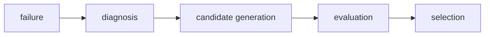

SkillNet, напротив, остаётся registry/population infrastructure.

### 3.4 Governance

Отвечает за:

```text
TrustPolicy
RiskPolicy
Approval
Revocation
ExecutionAuthority
PromotionPolicy
```

Базовая effect/safety policy должна быть частью обязательного kernel, а не отключаемым extension pack.

---

## 4. Роль ActiveGraph в гексагональной архитектуре

ActiveGraph одновременно реализует несколько внешних адаптеров.

### 4.1 Входящий адаптер

Behavior получает ActiveGraph event и вызывает application use case:

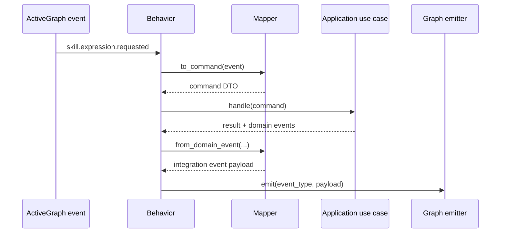

Пример тонкого behavior:

```python
@behavior(
    name="expression_request_handler",
    on=["skill.expression.requested"],
)
def expression_request_handler(event, graph, ctx):
    command = activegraph_mapper.to_command(event)

    result = container.prepare_expression.handle(command)

    for domain_event in result.events:
        event_type, payload = activegraph_mapper.from_domain_event(
            domain_event
        )
        graph.emit(event_type, payload)
```

Behavior должен быть тонким:

```text
deserialize
→ call use case
→ serialize result
```

В behavior не должно быть:

- поиска skill;
- принятия promotion decision;
- type checking;
- grounding logic;
- прямых HTTP-запросов;
- эвристик эволюции.

ActiveGraph требует детерминированности behavior bodies; внешние I/O должны проходить через контролируемые runtime-примитивы, иначе replay и fork перестают быть воспроизводимыми. [3]

### 4.2 Исходящий адаптер

ActiveGraph может реализовать порты:

```text
EventJournalPort
WorldProjectionPort
ExperimentWorkspacePort
TraceReaderPort
StructuralDiffPort
ApprovalPort
```

Пример порта:

```python
class ExperimentWorkspacePort(Protocol):
    def fork(
        self,
        parent_run: RunId,
        cutoff: EventId,
        variation: ExperimentVariation,
    ) -> ExperimentRun:
        ...

    def diff(
        self,
        baseline: RunId,
        candidate: RunId,
    ) -> StructuralDiff:
        ...
```

ActiveGraph adapter реализует этот интерфейс через fork/diff API.

Общий prefix форка восстанавливается из сохранённого event log и cache, а независимое исполнение начинается после точки ветвления. Для краткоживущих ветвей, которые снова сходятся, ActiveGraph предлагает frames; для сохраняемых и независимо сравниваемых вариантов — forks. [4]

### 4.3 Read-model адаптер

ActiveGraph graph лучше рассматривать как:

```text
projection / read model / reactive workspace
```

а не как единственное представление доменных aggregates.

Правило:

```text
Domain invariants        → domain layer
Application decisions    → application layer
Graph schemas            → boundary validation/read models
Event log                → durable execution history
```

Pydantic schema объекта ActiveGraph проверяет форму данных, но не должна заменять доменную модель и её инварианты. Pack types действительно представляются Pydantic-схемами, а pack version, prompts и settings участвуют в replay contract. [5]

---

## 5. Порты

### 5.1 Входящие порты: use cases

```python
class RegisterGeneUseCase(Protocol):
    def handle(self, command: RegisterGene) -> UseCaseResult: ...

class PrepareExpressionUseCase(Protocol):
    def handle(self, command: PrepareExpression) -> UseCaseResult: ...

class ExecuteApprovedPlanUseCase(Protocol):
    def handle(self, command: ExecuteApprovedPlan) -> UseCaseResult: ...

class VerifyOutcomeUseCase(Protocol):
    def handle(self, command: VerifyOutcome) -> UseCaseResult: ...

class DiagnoseFailureUseCase(Protocol):
    def handle(self, command: DiagnoseFailure) -> UseCaseResult: ...

class EvaluateCandidateUseCase(Protocol):
    def handle(self, command: EvaluateCandidate) -> UseCaseResult: ...

class PromoteCandidateUseCase(Protocol):
    def handle(self, command: PromoteCandidate) -> UseCaseResult: ...
```

### 5.2 Исходящие порты

```text
GeneRepository
ExpressionProfileRepository
EvaluationEvidenceRepository

ContextObserver
CapabilityCatalog
PatternIndex
GroundingEngine

PrimitiveExecutor
ArtifactStore
SandboxRuntime
OutcomeVerifier

TrustStore
SignatureVerifier
PolicyGate
ApprovalGateway

SkillRegistryGateway
ExperimentWorkspace
ModelGateway
Clock
IdGenerator
```

### 5.3 Возможные адаптеры

| Порт | Возможные адаптеры |
| --- | --- |
| `GeneRepository` | CAS, PostgreSQL, filesystem |
| `ContextObserver` | Browser, OpenAPI, MCP, Git, SQL, ActiveGraph |
| `PatternIndex` | graph search, vector DB, lexical index |
| `PrimitiveExecutor` | MCP, HTTP, local Python, WASM, container |
| `ExperimentWorkspace` | ActiveGraph forks |
| `SkillRegistryGateway` | SkillNet, private registry |
| `PolicyGate` | local rules, OPA, human approval |
| `OutcomeVerifier` | deterministic tests, LLM judge, domain verifier |

---

## 6. ExpressionProfile как обобщение TIP

Статья SkillMigrator хранит TIP как комбинацию:

```text
intent
operation template
slot schema
structural sketch
```

Затем система:

1. ищет skill по текстовому и структурному сходству;
2. извлекает значения для абстрактных slots;
3. связывает slots с текущими controls;
4. разворачивает фиксированный template в primitive actions.

Сохранённый TIP не содержит живых browser references; они разрешаются заново при исполнении. [6]

В этой архитектуре TIP является частным browser-specific видом более общей сущности:

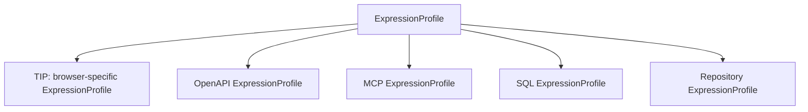

Название `TIP` лучше сохранить только для browser adapter, а в core использовать:

```text
ExpressionProfile
```

или формально:

```text
Transferable Expression Pattern
```

---

## 7. Универсальная модель ExpressionProfile

```yaml
expression_profile:
  profile_id: sha256:...
  gene_id: sha256:...
  modality: api.openapi

  intent:
    operation: create_entity

  operation_template:
    - resolve_target
    - bind_payload
    - propose_effect
    - commit
    - verify

  slots:
    target:
      semantic_type: ResourceCollection
      cardinality: exactly_one

    title:
      semantic_type: Text.Title
      cardinality: exactly_one

    body:
      semantic_type: Text.Body
      cardinality: optional

  context_contract:
    required_affordances:
      - role: collection_create
      - role: structured_payload
      - role: identity_result

    topology:
      - collection_create accepts structured_payload
      - collection_create produces identity_result

    state_predicates:
      - target.is_available
      - credentials.allow_write

    forbidden_affordances:
      - destructive_replace
      - bulk_delete

  grounding_policy:
    value_binding: semantic_assignment
    resource_binding: typed_graph_matching
    minimum_confidence: 0.85
    ambiguity: reject
    missing_required_slot: fallback

  effects:
    external_write: true
    reversible: conditionally
    approval: required

  outcome_contract:
    - created_resource_exists
    - created_resource_matches_payload
```

Состав профиля:

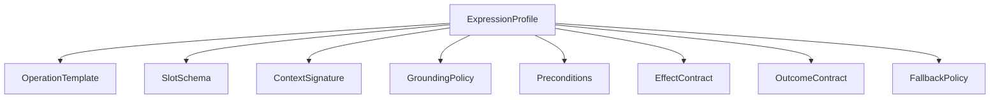

---

## 8. ContextSignature вместо browser structural sketch

В браузере structural sketch — это accessibility tree.

В общей модели:

```text
ContextSignature = typed attributed graph pattern
```

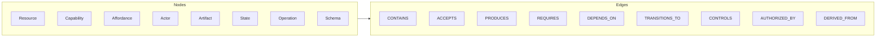

Формально:

```text
C = (N, E, τ, α)
```

где:

- `N` — наблюдаемые сущности и affordances;
- `E` — структурные отношения;
- `τ` — типы;
- `α` — свойства, состояния и ограничения.

Browser accessibility tree — только один адаптер, преобразующий внешнюю среду в `ContextSnapshot`.

---

## 9. Применение за пределами браузера

| Среда | ContextSnapshot | Абстрактные slots | Grounding |
| --- | --- | --- | --- |
| Browser | accessibility tree | title, body, submit | controls/refs |
| REST/OpenAPI | endpoints + schemas | resource, payload, id | method, path, fields |
| MCP | tools/resources graph | capability, arguments | tool name + JSON args |
| SQL | schema + FK graph | dimensions, measures, keys | tables/columns |
| Git repository | file/AST/build graph | target symbol, change, test | files/functions/tests |
| Filesystem | directory/type graph | source, destination, format | paths/readers/writers |
| Event system | topics + event schemas | command, correlation, result | topic/event fields |
| Workflow | state machine + actors | request, approver, commit | roles/transitions |
| Research | source/evidence graph | query, claim, citation | indexes/documents |
| Cloud/IaC | resource/dependency graph | service, policy, deployment | provider resources |
| Robotics | scene/affordance graph | object, pose, action | sensor/actuator targets |

### Пример: API

Один профиль:

```text
create structured resource
```

может экспрессироваться через:

```text
GitHub POST /issues
Jira POST /issue
Linear mutation issueCreate
MCP tool create_ticket
internal RPC CreateTask
```

Общая морфология:

```text
write capability
  accepts structured payload
  produces persistent identity
  supports subsequent verification
```

Названия полей и протоколы различаются, но pattern одинаков.

### Пример: Git repository

Паттерн:

```text
locate configuration binding
→ update typed value
→ validate syntax
→ run focused test
```

Он может переноситься между:

```text
pyproject.toml
package.json
Cargo.toml
GitHub Actions YAML
Kubernetes manifest
```

Здесь structural context — не DOM, а:

```text
file type
AST/config path
dependency graph
validation command
```

### Пример: организационный процесс

Паттерн:

```text
prepare request
→ identify authorized approver
→ submit
→ wait for approval
→ commit
→ verify
```

Он может применяться к:

```text
expense approval
access request
contract review
deployment approval
publication workflow
```

---

## 10. Универсальный grounding pipeline

Идею SkillMigrator стоит обобщить до четырёх стадий.

```mermaid
flowchart LR
    Input[Task input] --> VG[1. Value grounding]
    VG --> CG[2. Context grounding]
    CG --> CS[3. Constraint solving]
    CS --> COMP[4. Compilation]
    COMP --> Gates[Static gates]
    Gates --> Effect[Effect gate]
    Effect --> Approval[Approval]
    Approval --> Execution[Execution]
    Execution --> Verification[Outcome verification]
```

### 10.1 Value grounding

```text
task input
→ semantic slots
```

Пример:

```text
"Создай issue о падении CI"
→ title
→ description
→ severity
→ target_repository
```

### 10.2 Context grounding

```text
semantic slots
→ resources / capabilities / affordances
```

Пример:

```text
target_repository → repository node
title             → API request.title
description       → API request.body
commit            → create_issue operation
```

### 10.3 Constraint solving

Проверяются:

```text
types
cardinality
topology
state
permissions
effects
preconditions
negative constraints
```

В SkillMigrator обе стадии binding используют assignment-задачи, включая Hungarian matching. Для более общей системы одного bipartite matching будет недостаточно: many-to-one bindings, temporal dependencies и state transitions потребуют CSP, ILP или typed subgraph matching. [6]

### 10.4 Compilation

```text
GeneSpec
+ ExpressionProfile
+ BindingInstance
→ ExecutablePlan
```

---

## 11. Применимость: hard constraints перед ranking

Не следует разрешать исполнение только потому, что embedding или structural score высок.

```text
Applicable(g, p, c) =
    Trust(g)
    ∧ TypeCompatible(g, c)
    ∧ CapabilitiesAvailable(g, c)
    ∧ EffectsAllowed(g, c)
    ∧ PreconditionsHold(p, c)
    ∧ GroundingFeasible(p, c)
```

Только после hard filters допустим ranking:

```text
Rank(p, c) =
    w_s * S_semantic
  + w_g * S_structure
  + w_q * S_state
  + w_e * S_evidence
```

Порядок отбора:

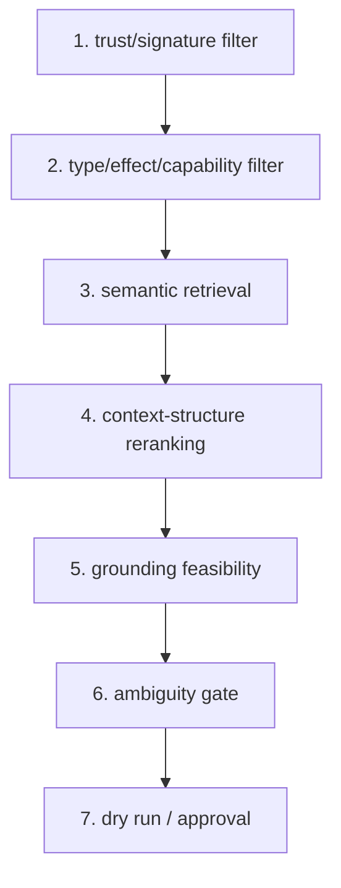

Статья показывает, что structural signal полезен для retrieval: удаление layout component заметно ухудшило результаты. Но structural similarity должно оставаться свидетельством применимости, а не выдавать полномочия на действие. [6]

---

## 12. Два уровня IR

Чтобы не раздувать alphabet SkillGenome под каждую среду, целесообразно использовать два промежуточных представления.

### 12.1 Semantic plan IR

Стабильный и modality-neutral:

```text
OBSERVE
VALIDATE
RESOLVE
READ
TRANSFORM
PROPOSE_EFFECT
COMMIT
VERIFY
STORE
```

Либо сохраняется текущий SkillGenome alphabet с эквивалентным разделением по effects.

### 12.2 Adapter execution IR

Специфичен среде:

```text
Browser:
    FillControl
    SelectOption
    ActivateControl

OpenAPI:
    BuildRequest
    InvokeOperation
    ParseResponse

Repository:
    LocateSymbol
    ApplyPatch
    RunTest

SQL:
    ResolveRelation
    CompileQuery
    ExecuteRead
```

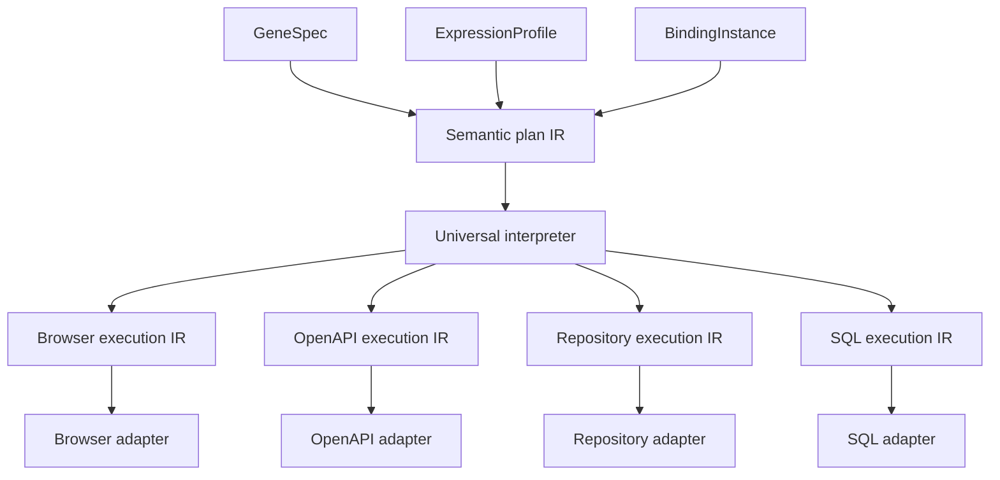

Универсальный интерпретатор управляет:

```text
control flow
types
effects
policy
provenance
outcome verification
```

Модальный адаптер реализует только leaf operations.

Так сохраняется принцип:

> Один интерпретатор — много генов — несколько адаптеров экспрессии.

---

## 13. Рекомендуемое разделение packs

### 13.1 Первый этап: один modular-monolith pack

```text
activegraph-skill-kernel-pack
```

Внутри:

```text
registration
retrieval
expression preparation
binding
static gates
effect gate
execution coordination
verification
failure recording
```

При этом доменная и application-логика находится в отдельной библиотеке:

```text
active-skill-core
```

Так проще стабилизировать ontology и event contracts.

### 13.2 После стабилизации

```text
activegraph-skill-kernel-pack
    GeneSpec ontology
    event vocabulary
    interpreter coordination
    mandatory policies

activegraph-skill-evolution-pack
    diagnosis
    candidate generation
    experiments
    promotion

activegraph-skill-governance-pack
    organization-specific approvals
    revocation
    trust propagation

activegraph-expression-web-pack
activegraph-expression-api-pack
activegraph-expression-repository-pack
activegraph-expression-data-pack
```

Modality adapters не обязательно должны быть ActiveGraph packs. Делать их pack имеет смысл только когда они добавляют:

- собственные object/relation types;
- behaviors;
- policies;
- runtime settings;
- operator-visible lifecycle.

Простой HTTP или MCP adapter лучше оставить обычным infrastructure package.

---

## 14. Взаимодействие packs

Не через прямые вызовы `behavior → behavior`.

Правильно:

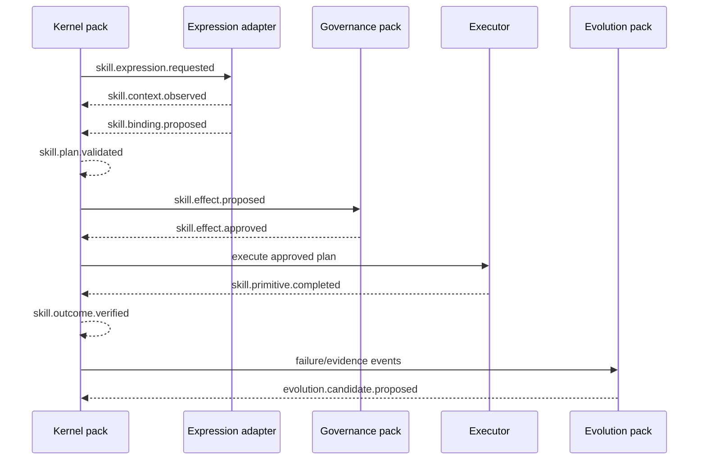

Общая схема:

```text
shared contracts package
       ↓
versioned integration events
       ↓
independently loaded packs
```

Стоит различать:

```text
DomainEvent       # внутреннее семантическое событие
IntegrationEvent  # сериализованный контракт между packs
ActiveGraphEvent  # transport representation
```

Пример доменного события:

```python
@dataclass(frozen=True)
class BindingProposed:
    gene_id: GeneId
    profile_id: ProfileId
    context_id: ContextId
    binding: BindingSet
    confidence: Confidence
```

ActiveGraph adapter преобразует его в:

```json
{
  "type": "skill.binding.proposed.v1",
  "payload": {
    "gene_id": "sha256:...",
    "profile_id": "sha256:...",
    "context_id": "sha256:...",
    "binding": {},
    "confidence": 0.91
  }
}
```

---

## 15. Предлагаемая структура репозитория

```text
active-skill-system/
├── src/
│   ├── active_skill/
│   │   ├── domain/
│   │   │   ├── genome/
│   │   │   ├── expression/
│   │   │   ├── evolution/
│   │   │   └── governance/
│   │   │
│   │   ├── application/
│   │   │   ├── commands/
│   │   │   ├── handlers/
│   │   │   ├── ports/
│   │   │   └── process_managers/
│   │   │
│   │   └── contracts/
│   │       ├── events/
│   │       └── dto/
│   │
│   ├── adapters/
│   │   ├── activegraph/
│   │   │   ├── inbound/
│   │   │   ├── outbound/
│   │   │   ├── projections/
│   │   │   └── mapping/
│   │   ├── skillnet/
│   │   ├── mcp/
│   │   ├── openapi/
│   │   ├── repository/
│   │   ├── browser/
│   │   ├── sandbox/
│   │   └── persistence/
│   │
│   └── packs/
│       ├── skill_kernel/
│       ├── skill_evolution/
│       └── expression_web/
│
├── tests/
│   ├── domain/
│   ├── application/
│   ├── adapter_contracts/
│   ├── replay/
│   └── evaluation/
└── pyproject.toml
```

---

## 16. Ключевые архитектурные правила

1. **Packs являются доверенным кодом; genes и profiles — недоверенными данными.** ActiveGraph pack — полноценный Python-пакет, а не декларативный manifest, поэтому один downloaded skill нельзя превращать в отдельный pack. [1]
2. **Domain не знает про ActiveGraph.**
3. **Behaviors являются тонкими inbound adapters.**
4. **ActiveGraph object graph является projection, а event log — историей исполнения.** ActiveGraph прямо строится как append-only event log с графовой проекцией и fork/diff поверх него. [7]
5. **Никакого прямого I/O в behaviors.**
6. **Любое внешнее изменение сначала становится `EffectIntent`.**
7. **ExpressionProfile определяет применимость, но не полномочия.**
8. **BindingInstance локален и не публикуется как GeneSpec.**
9. **Новая версия GeneSpec создаётся как новый immutable content hash.**
10. **Fork применяется к экспериментам, а не к основной бизнес-логике.**

---

## Итоговая рекомендация

Реализовывать следует так:

```text
active-skill-core
    = чистая onion/hexagonal domain + application library

activegraph-skill-kernel-pack
    = ActiveGraph inbound/outbound adapter + composition root

ExpressionProfile
    = обобщённая модель контекстной экспрессии

TIP
    = browser-specific ExpressionProfile

modality adapters
    = преобразование Browser/API/MCP/SQL/Git/Workflow
      в общий ContextSnapshot и BindingInstance

ActiveGraph forks
    = реализация ExperimentWorkspacePort

SkillNet
    = RegistryGateway adapter

EvoSkill
    = variation/selection application module
```

Наиболее точная формула:

> **GeneSpec описывает, что должно быть сделано. ExpressionProfile — в какой структуре среды это применимо. Adapter — как наблюдать и воздействовать на конкретную среду. ActiveGraph — что фактически произошло и как сравнить альтернативные исполнения.**

Для первого инкремента оптимален **один ActiveGraph modular-monolith pack**, но с уже выделенными domain/application/ports. После стабилизации event vocabulary и ontology отделяются optional evolution и modality packs.

---

## Источники

1. [Authoring packs — Active Graph](https://docs.activegraph.ai/guides/authoring-packs/?utm_source=chatgpt.com)
2. [Hexagonal Architecture — Alistair Cockburn](https://alistair.cockburn.us/hexagonal-architecture)
3. [Behaviors — Active Graph](https://docs.activegraph.ai/concepts/behaviors/?utm_source=chatgpt.com)
4. [The Log is the Agent — arXiv](https://arxiv.org/html/2605.21997v1)
5. [Packs — Active Graph API Reference](https://docs.activegraph.ai/reference/api/packs/)
6. [Beyond Domains: Reusing Web Skills via Transferable Interaction Patterns — arXiv](https://arxiv.org/html/2606.17645v1)
7. [ActiveGraph GitHub repository](https://github.com/yoheinakajima/activegraph)
8. [SkillGenome GitHub repository](https://github.com/jscheiber78-droid/skillgenome)
9. [SkillNet GitHub repository](https://github.com/zjunlp/SkillNet)
